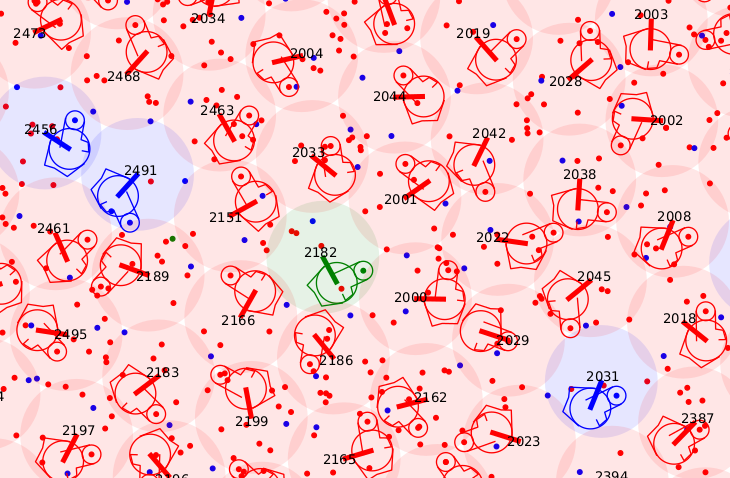

.. _usage:

Usage
===============

The fiberassign package has some main scripts as well as lower-level python
tools that can be used in custom scripts.

.. _basictools:

Basic Tools
---------------------

There are several command-line programs which can be used to drive the fiber
assignment process.  The first is the :ref:`script_fba_run` script which takes
one or more target files and other options

.. include:: _static/fba_run.inc

**EXAMPLE:**  One could run this with mostly default options::

    %> fba_run --targets mtl.fits standards.fits sky.fits other_targets.fits \
       --write_all_targets \
       --dir out_raw

The names of the target files above are arbitrary and they can contain any
targets.  The full list of targets is built up in memory from the contents of
these files.  Running this command will produce an output directory of files
(one per tile) containing the basic target information and assignment results.
For now, this "raw" output format is slightly different than the one used
historically, and does not contain all the information that was in the original
target catalog.  This will be changed in the future.  For now, files with this
extra info can be created by post-processing the output with the
:ref:`script_fba_merge_results` script:

.. include:: _static/fba_merge_results.inc

**EXAMPLE:**  Continuing our minimal example from above::

    %> fba_merge_results \
       --targets mtl.fits standards.fits sky.fits other_targets.fits \
       --dir out_raw \
       --out out_merged

There are several built-in tools for doing quality assurance of the resulting
assignment.  One of these is the :ref:`script_fba_run_qa` script.  This will
compute the per-tile counts for the different target types and write these to
JSON file (by default named "qa.json" in the output directory):

.. include:: _static/fba_run_qa.inc

**EXAMPLE:**  One could run this on our example output with::

    %> fba_run_qa --dir out_raw

It is also frequently useful to plot the results of the assignment.  There are
many customized plotting options possible using the low-level tools, but there
is also a command-line script to create a PDF format plot of each tile.  By
default, this script plots all petals of all tiles using a "simple"
representation of each positioner (two lines).  Running
:ref:`script_fba_plot` in this way will require several minutes per
tile, but multiple processes will be used to plot tiles in parallel:

.. include:: _static/fba_plot_results.inc

**EXAMPLE:**  In our example, let's plot only one tile and use options to plot
the full positioner geometry.  Notice how we made a text file with just one
tile ID to use::

    %> cat plot_tiles.txt
    11108
    %> fba_plot_results \
       --tiles plot_tiles.txt \
       --dir out_raw \
       --real_shapes

In the plot above, science targets are red, sky is blue, standards are orange, and dual science / standard targets are green.

We can also make a crude visualization of the QA for the entire footprint using
the :ref:`script_fba_plot_qa` script.  Note that when plotting only a few tiles
the resulting plot is not as useful (but in that case you can get the numbers
directly out of the JSON):

.. include:: _static/fba_plot_qa.inc

**EXAMPLE:**  For our small test above we could do::

    %> fba_plot_qa --qafile "out_raw/qa.json"

If you are only plotting a few tiles and want to see the tile IDs on the plot,
use the `--labels` option.

.. todo::
    Document the use of the `qa-fiberassign` tool, after verifying that
    it still works.

Interactive Debugging and Testing
-----------------------------------------

The fiberassign codebase respects the DESI_LOGLEVEL environment variable.  The
default level if this is not set is "INFO".  Setting this environment variable
to "DEBUG" will produce more detailed output.  There are other environment
variables that can be set to dump even more details about the internal
assignment process.  Examples::

    %> export DESI_DEBUG_TARGET=123456789
    %> export DESI_DEBUG_LOCATION=4321
    %> export DESI_DEBUG_TILE=1111

These options are combined with a logical OR and any combination of tile,
fiber, or target specified will have all possible info logged.

.. warning::
    Use of these "extra" debug variables will have a HUGE impact on code
    performance.  Do not use in large production runs.

Data File Testing
---------------------

It is often useful to see if a given set of input target files are compatible
with all of the commandline tools in fiberassign.  This usage pattern was so
common that a high-level script was created:

.. include:: _static/fba_fulltest.inc

This runs the specified files through the assignment and merging, as well as
running QA and plotting on both the raw outputs and the merged outputs.

Legacy Compatibility Wrappers
---------------------------------------

In order to maintain backwards compatibility with the previous version of
fiberassign, there is a replacement wrapper script called ``fiberassign`` which
translates the command line options into arguments to pass to the newer
scripts.

Running ``fiberassign --help`` gives the full set of command line
options::

  usage: fiberassign [-h] --mtl MTL --sky SKY --stdstar STDSTAR
                   --fibstatusfile FIBSTATUSFILE
                   [--footprint FOOTPRINT]
                   [--positioners POSITIONERS] [--surveytiles SURVEYTILES]
                   [--telra TELRA] [--teldec TELDEC] [--tileid TILEID]
                   [--tileobsconditions TILEOBSCONDITIONS] [--outdir OUTDIR]
                   [--starmask STARMASK] [--rundate RUNDATE]
                   [--gfafile GFAFILE] [--nstarpetal NSTARPETAL]
                   [--nskypetal NSKYPETAL] [--nocleanup]

  optional arguments:
  -h, --help            show this help message and exit
  --mtl MTL             input targets (FITS file)
  --sky SKY             input sky positions (FITS file)
  --stdstar STDSTAR     input std stars (FITS file)
  --fibstatusfile FIBSTATUSFILE
                        list of positioners and its status (ECSV file)
  --footprint FOOTPRINT
                        list of tiles defining the footprint (FITS file)
  --positioners POSITIONERS
                        list of positioners on the focal plane (FITS file)
  --surveytiles SURVEYTILES
                        set of tiles to run fiberassign on (text file)
  --telra TELRA         Right Ascension of arbitrary pointing - overrides
                        --surveytiles
  --teldec TELDEC       Declination of arbitrary pointing - overrides
                        --surveytiles
  --tileid TILEID       Integer ID of arbitrary pointing - overrides
                        --surveytiles
  --tileobsconditions TILEOBSCONDITIONS
                        Mask describing observing program (DARK:1, GRAY:2,
                        BRIGHT:4) - overrides --surveytiles
  --outdir OUTDIR       output directory (default = ./)
  --starmask STARMASK   integer mask defining standard stars
  --rundate RUNDATE     run date [YYYY-MM-DD]
  --gfafile GFAFILE     GFA file (FITS tile)
  --nstarpetal NSTARPETAL
                        number of standard stars per petal (default=10)
  --nskypetal NSKYPETAL
                        number of sky fibers per petal (default=40)
  --nocleanup

An example that provides the minimal set of required arguments would be::

  fiberassign  --mtl mtl.fits --stdstar std.fits --sky sky.fits
  --fibstatusfile fiberstatus.ecsv --outdir $SCRATCH/temp/

In this example there are four files that must be **explicitly**
provided:

- ``mtl.fits``:  DESI Merged Target List files contain a single binary
  table covering the entire footprint. They contain the variables in
  the Targets files plus other variables that define the priority and
  number of observations as required by fiber assignment. These
  variables are computed using the available information both in the
  target and the DESI redshift catalogs. The full datamodel can be
  found `here <https://desidatamodel.readthedocs.io/en/latest/DESI_TARGET/mtl.html>`_.

- ``std.fits``: DESI standard star locations contain a single binary
  table covering the entire footprint. They contain the variables in
  the Targets files with the objects that were flagged as
  standards. This file follows the `mtl` datamodel.

- ``sky.fits``:  DESI sky locations contain a single binary table
  covering the entire Legacy Surveys footprint. The imaging “blob
  maps” are bisected to achieve a requisite number of sky locations
  per sq. deg. Sky locations are placed within the bisected grid as
  far from blobs that contain sources as is possible. Flux is measured
  in an aperture at each sky location. This file follows the `mtl` datamodel.

- ``fiberstatus.ecsv``:
